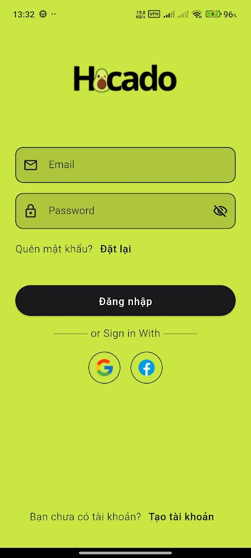
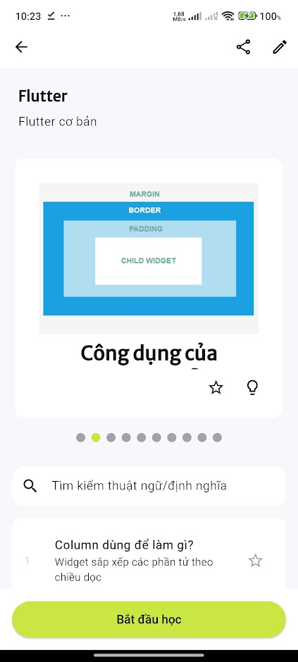
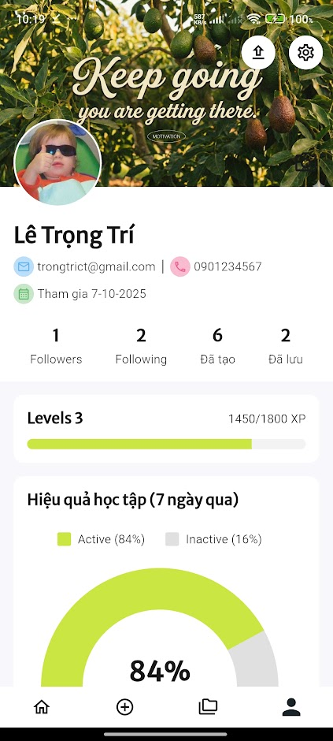

# Hocado – Flashcard-Based Study Application

Hocado is a cross-platform mobile learning application designed to enhance long-term knowledge retention through Active Recall and the Spaced Repetition System (SRS). Built with Flutter and integrated with Firebase services, the app offers a streamlined study experience with smart deck creation, AI-powered content generation, and detailed learning analytics.

## Overview
Hocado enables users to create flashcard decks, study with adaptive repetition cycles, take tests, explore public decks shared by others, and track learning progress. The system emphasizes cognitive-science-based learning while maintaining a clean, modern, and highly responsive user interface.

<table>
  <tr>
    <td valign="top" style="width:30%;">
      

        
      

      

        
      

      

        
      

      

        
      

    </td>
    <td valign="top" style="width:70%">
      
## Key Features
### **Flashcard & Deck Management**
- Create, edit, and organize flashcards with text or images
- Deck grouping and flexible card editing
- Import documents (TXT/PDF/DOCX) for instant deck generation

### **Study Mode**
- Spaced Repetition algorithm adjusts review intervals
- Multiple study types: flashcard view, true/false, multiple choice, written mode
- Progress-aware scheduling for more efficient study cycles

### **Test Mode**
- Auto-generated quizzes based on deck content
- Scoring, review, and performance summary

### **AI-Powered Deck Creation**
- Generate structured flashcards from uploaded documents
- Utilizes Gemini API for semantic parsing and card construction

### **Public Library & Social Features**
- Browse, search, and save public decks
- Follow deck creators and view their shared collections

### **User Profile & Settings**
- Customizable profile with avatar
- Progress charts, statistics, and learning history
- Theme modes (Light/Dark/System), sound options, daily reminders

## Architecture
The application follows a clean multi-layer architecture with clear separation of concerns:
- Models: Core data structures
- Services: Firebase Auth, Firestore, Storage, Gemini API
- Repositories: Data access and transformation layer
- ViewModels: Business logic using Riverpod for state management
- Views: Flutter UI built with declarative widgets
This architecture ensures maintainability, scalability, and predictable data flow.

## Frontend
- Framework: Flutter
- State Management: Riverpod
- Routing: Declarative Navigator 2.0 approach

## Backend
- Firebase Authentication for secure login/registration
- Cloud Firestore for real-time syncing of decks, cards, and user data
- Cloud Storage for image uploads
- Cloud Functions for background processing and event handling
- Gemini API for AI-generated flashcards
- Local Storage: SharedPreferences for caching preferences

## Local Persistence
- SharedPreferences for app settings and theme mode
- Internal caching for temporary study data

## Tech Stack
- Flutter (UI and business logic)
- Dart
- Firebase Auth, Firestore, Storage, Functions
- Gemini API
- Riverpod (state management)
- SharedPreferences

    </td>
  </tr>
</table>
